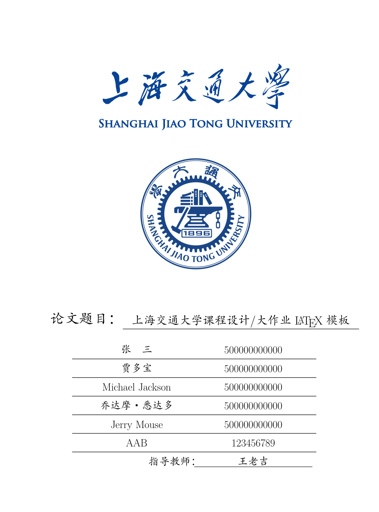

# 上海交通大学课程大作业论文模板

这是为撰写上海交通大学课程作业、课程设计而准备的 XeLaTeX 模板，非官方出品。生成的学位论文文件参见 [thesis.pdf](./thesis.pdf)。

**本项目是 [dyweb/SJTUThesis](https://github.com/dyweb/SJTUThesis) 的一个 Fork，不保证与上游的兼容性。**

## 论文效果

      

## 问题诊断

编译失败时，可以尝试手动逐次编译。
结合文档 [document.pdf](./document.pdf) 中的说明，有助于定位故障。

    xelatex -no-pdf thesis
    biber --debug thesis
    xelatex thesis
    xelatex thesis

## 软件许可证

上海交通大学校徽图片(`sjtulog.png`)和横幅图片(`sjtubanner.png`)的版权归原作者所有。其他部分使用 [Apache License 2.0](LICENSE) 授权。
